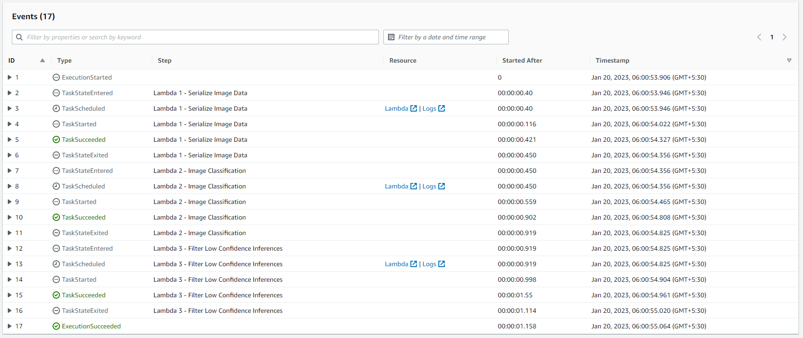
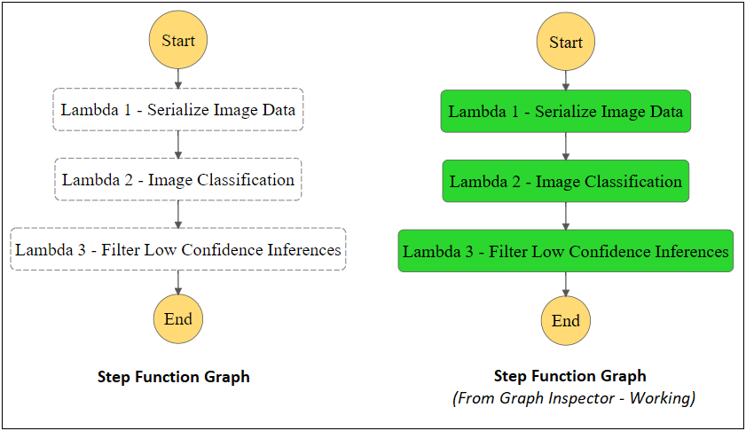
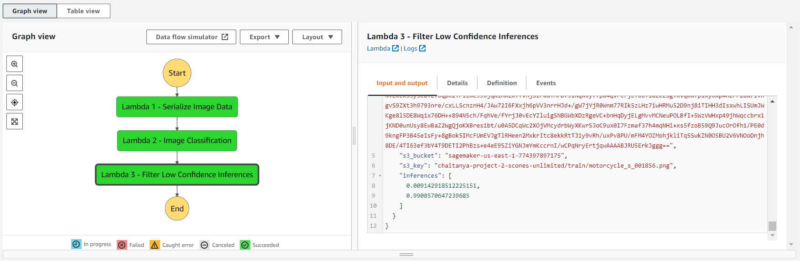

# Build a ML Workflow for Scones Unlimited on Amazon SageMaker
Build and deploy an image classification model (End to End ML Workflow) for Scones Unlimited, a scone-delivery-focused logistic company, using AWS SageMaker.


 Image Classifiers are used in the field of computer vision to identify the content of an image and it is used across a broad variety of industries, from advanced technologies like autonomous vehicles and augmented reality, to eCommerce platforms, and even in diagnostic medicine.

In this project, we'll be building an image classification model that can automatically detect which kind of vehicle delivery drivers have, in order to route them to the correct loading bay and orders. Assigning delivery professionals who have a bicycle to nearby orders and giving motorcyclists orders that are farther can help Scones Unlimited optimize their operations.

As an MLE, our goal is to ship a scalable and safe model. Once our model becomes available to other teams on-demand, it’s important that your model can scale to meet demand, and that safeguards are in place to monitor and control for drift or degraded performance.

In this project, we’ll use AWS Sagemaker to build an image classification model that can tell bicycles apart from motorcycles. We'll deploy your model, use AWS Lambda functions to build supporting services, and AWS Step Functions to compose our model and services into an event-driven application


## ML Workflow for Scones Unlimited on Amazon SageMaker

### Project Overview

This project is an end-to-end machine learning (ML) workflow developed for Scones Unlimited, a fictional bakery that wants to enhance its business operations. The objective is to leverage Amazon SageMaker to create, deploy, and manage ML models that optimize inventory management and customer satisfaction.

### Features

- **Data Preprocessing**: Cleaning and transforming bakery data to make it suitable for ML modeling.
- **Model Development**: Creating ML models to predict demand, optimize inventory, and improve supply chain management.
- **Amazon SageMaker Integration**: Utilizing Amazon SageMaker for model training, deployment, and management.
- **Monitoring & Auto-Scaling**: Implementing monitoring and auto-scaling mechanisms to ensure model performance and cost-efficiency.
- **Data Visualization**: Generating insightful data visualizations for stakeholders.

### Prerequisites

- [Amazon Web Services (AWS) Account](https://aws.amazon.com/)
- [Amazon SageMaker](https://aws.amazon.com/sagemaker/) access
- Python 3.7+
- Jupyter Notebook (optional but recommended)

### Setup

1. **Clone the Repository**:

   ```bash
   git clone https://github.com/yourusername/scones-unlimited-ml-workflow.git
   cd scones-unlimited-ml-workflow
   ```

2. **Install Dependencies**:

   ```bash
   pip install -r requirements.txt
   ```

3. **Configure AWS**:

   - Configure your AWS credentials using AWS CLI or create an AWS configuration file (`~/.aws/config` and `~/.aws/credentials`).

4. **Data Preparation**:

   - Obtain and preprocess the bakery data (not included in this repository).
   - Store the data in the `data/` directory.

5. **Jupyter Notebook**:

   - Explore the provided Jupyter notebooks for data preprocessing and model development.

6. **Amazon SageMaker**:

   - Utilize SageMaker to train and deploy models.
   - Refer to SageMaker documentation for detailed instructions.


### 1. Individual AWS Lambda functions drafted to build an AWS Step Functions Workflow:<br>

1. The `serializeImageData` Lambda Function takes the address of an image hosted in S3, and returns a serialized JSON object.<br>
2. The `Image-Classification` Lambda Function accepts the JSON object obtained from step 1 and sends it to an endpoint, collecting inferences as a JSON object.<br>
3. The `Filter Low Confidence Inferences` Lambda Function takes the inference data from step 2, and filters only the images that meet the pre-defined threshold.<br>

### 2. Building a State Machine via AWS Step Functions

#### 2.1. Execution Flow of the Step Function 



#### 2.2. Step Function Graph



#### 2.3. Step Function Output




### Usage

- The project includes Jupyter notebooks to guide you through data preprocessing and model development.
- Follow the instructions provided in the notebooks to create, train, and deploy ML models using Amazon SageMaker.
- Monitor model performance and adjust auto-scaling settings as needed.

### Project Structure

```
scones-unlimited-ml-workflow/
│
├── data/              # Data directory (store bakery data here)
├── notebooks/         # Jupyter notebooks for data processing and model development
├── src/               # Custom Python scripts and utilities
├── requirements.txt   # Python package dependencies
├── README.md          # Project documentation
├── LICENSE            # Project license
```

### Contributing

Contributions are welcome! If you'd like to enhance the project, open issues, or submit pull requests, please follow these guidelines:

1. Fork the repository.
2. Create your feature branch: `git checkout -b feature-name`.
3. Commit your changes: `git commit -m 'Add some feature'`.
4. Push to the branch: `git push origin feature-name`.
5. Submit a pull request.

### License

This project is licensed under the MIT License - see the [LICENSE](LICENSE) file for details.
```

